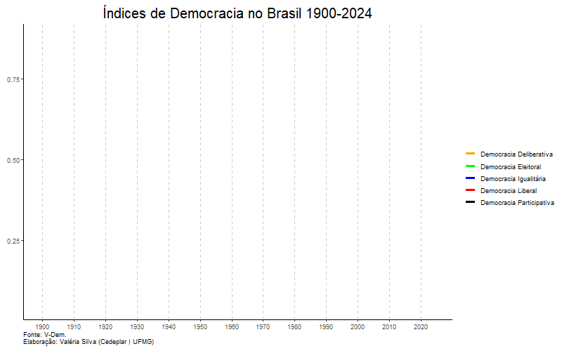

# 📊 Como definir democracia? Visualização com dados do V-Dem

**Objetivo do Projeto**  
Este projeto tem como propósito disseminar o uso de bases públicas de dados e estimular a utilização do R como ferramenta de análise e comunicação científica. A partir de uma abordagem conceitual e empírica, visualizamos como a democracia brasileira evoluiu nas últimas décadas em diferentes dimensões.


---

## 🧠 Conceito e Aplicação
A democracia é um conceito multifacetado, que vai muito além da realização de eleições. Ela envolve aspectos como liberdade civil, igualdade de acesso ao poder, participação política e a qualidade do debate público e institucional.

Neste projeto, utilizam-se dados do Varieties of Democracy (V-Dem) — uma iniciativa internacional sediada na Universidade de Gotemburgo, que adota uma abordagem robusta e multidimensional para medir a democracia. O banco do V-Dem reúne mais de 450 indicadores, coletados anualmente desde 1789 para mais de 200 países, permitindo comparações históricas e geográficas em alta granularidade. 🌍

O foco desta análise está na trajetória brasileira entre 1900 e 2024, com base na evolução de cinco princípios de alto nível da democracia:
- **Democracia Deliberativa**: mede se o raciocínio público é inclusivo e se concentra no bem comum.
- **Democracia Igualitária**: mede o nível de igualdade de acesso a recursos e os direitos e liberdades entre vários grupos dentro de uma sociedade.
- **Democracia Eleitoral**: mede se as eleições foram livres e justas e se houve prevalência de uma mídia livre e independente. É considerado o elemento central e por isso incluído nos demais índices.
- **Democracia Participativa**: mede o quanto os cidadãos participam de seu próprio governo por meio de instituições democráticas locais, organizações da sociedade civil e democracia direta.
- **Democracia Liberal**: mede o estado de direito e liberdades civis.

Os países são classificados com notas que vão de 0 a 1, em que 0 representa um regime ditatorial completo e 1, democracia plena.

---

## 📦 Fonte dos Dados

Os dados são fornecidos pelo pacote R `vdemdata`. Para utilizá-los, basta instalar o pacote diretamente do GitHub:

```r
install.packages("remotes")
remotes::install_github("vdeminstitute/vdemdata")
```

A base completa é acessada como `vdemdata::vdem`.

---

## 📜 O que o script faz?

O script `democracy1.R`:

1. Filtra os dados do Brasil (a partir de 1900);
2. Seleciona variáveis dos cinco índices democráticos;
3. Reestrutura os dados com `pivot_longer`;
4. Gera uma animação com `ggplot2` + `gganimate` sobre a evolução da democracia no Brasil.

---

## ✨ Visualização Final

O resultado é um gráfico animado como o exemplo abaixo:



---
## 📈 Análise da Evolução dos Índices de Democracia no Brasil (1900–2024)
No gráfico é possível observar a evolução dos índices de democracia no Brasil entre 1900 e 2024. A série histórica evidencia três padrões principais na trajetória política do país: a alternância entre regimes democráticos e autoritários, o fortalecimento gradual da democracia nos períodos de estabilidade institucional e, mais recentemente, sinais de autocratização.

As diferentes dimensões analisadas — eleitoral, liberal, participativa, igualitária e deliberativa — acompanham trajetórias semelhantes, mas não idênticas. Enquanto a democracia eleitoral tende a apresentar recuperação mais rápida após rupturas institucionais, dimensões como a igualdade política ou a qualidade do debate público avançam de forma mais lenta e desigual. Nos anos recentes, os dados indicam uma tendência de declínio nos indicadores de democracia liberal e deliberativa, refletindo fragilizações nas garantias institucionais e no funcionamento dos freios e contrapesos.

---
## 🧰 Requisitos

```r
install.packages(c("tidyverse", "gganimate"))
remotes::install_github("vdeminstitute/vdemdata")
```

---

## ✍️ Autoria

Projeto por **Valéria Andrade Silva**  
Doutoranda em Economia – Cedeplar/UFMG  
💡 [LinkedIn](www.linkedin.com/in/valéria-andrade-silva)  
📧 valeria.andrade81@hotmail.com
